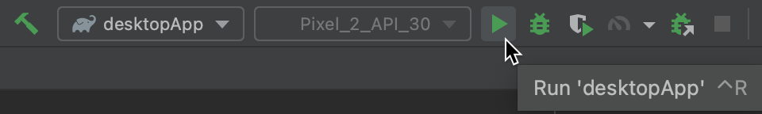
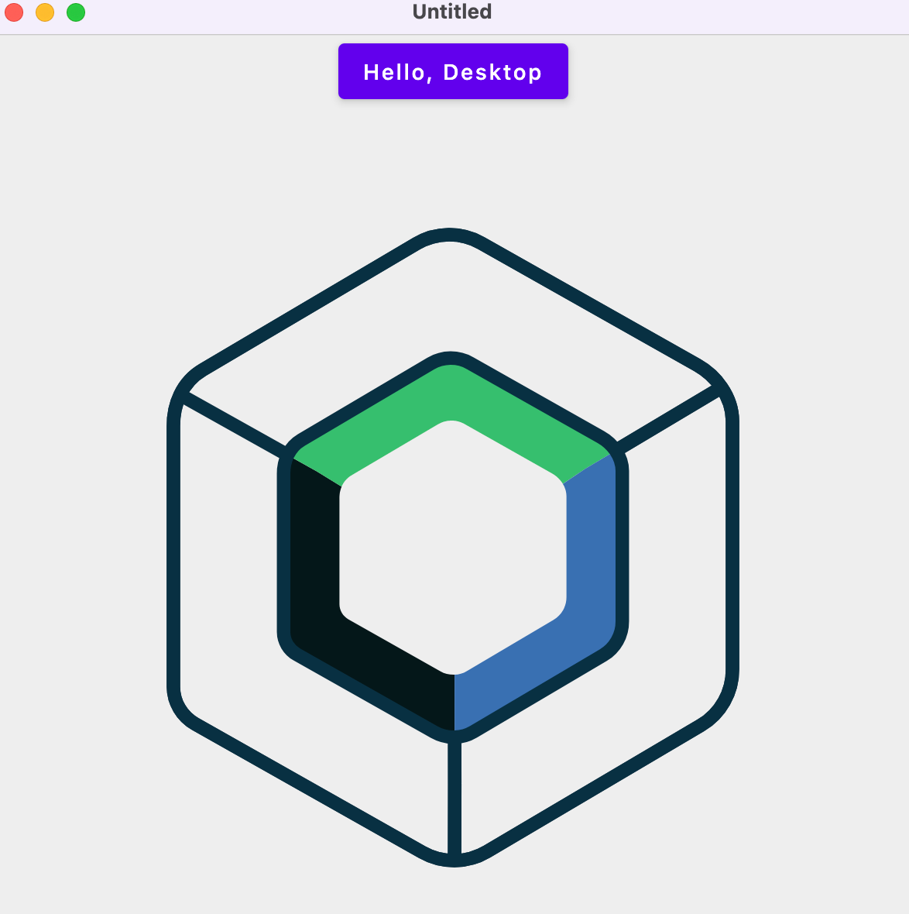

Para documentação em português, consulte o [README em Português](docs/README.pt.md).

# Cross-Platform Chat in Kotlin

This is a cross-platform chat project in Kotlin that utilizes Compose to create user interfaces for desktop and Android, OkHttp for communication with a WebSocket server, and Gson for message serialization.

## Features

- Cross-platform support for Desktop and Android.
- Real-time communication through a WebSocket server.
- Message serialization and deserialization using Gson.
- Simple and elegant user interface created with Compose.

## How to Use

### Prerequisites

- Make sure you have Android Studio or IntelliJ IDEA set up with Kotlin and Compose dependencies.

### Setup

1. Clone the repository:

   ```bash
   git clone https://github.com/eduardomcb/simple-chat-multiplatform.git
   cd simple-chat-multiplatform
   ```

2. Open the project in your development environment.

3. Build and run the application in your desired environment (Desktop or Android).

## Run your application

### On desktop

To run your desktop application in Android Studio, select `desktopApp` in the list of run configurations and click **Run**:

<br />



You can also run Gradle tasks in the terminal:

- `./gradlew run` to run application
- `./gradlew package` to store native distribution into `build/compose/binaries`

### On Android

To run your application on an Android emulator:

1. Ensure you have an Android virtual device available.
   Otherwise, [create one](https://developer.android.com/studio/run/managing-avds#createavd).
2. In the list of run configurations, select `androidApp`.
3. Choose your virtual device and click **Run**:

   <br />

   

<details>
  <summary>Alternatively, use Gradle</summary>

To install an Android application on a real Android device or an emulator, run `./gradlew installDebug` in the terminal.

</details>

## WebSocket Server

This chat project depends on a WebSocket server to function. You can find the source code for the WebSocket server in Node.js in the following repository:

[simple-chat-server](https://github.com/eduardomcb/simple-chat-server)

Make sure to set up and run the WebSocket server before starting the chat application.

## Contributions

If you'd like to contribute to this project, feel free to create pull requests or report issues in the [Issues](https://github.com/eduardomcb/simple-chat-multiplatform/issues) section.

## License

This project is licensed under the MIT License - see the [LICENSE](LICENSE) file for details.
